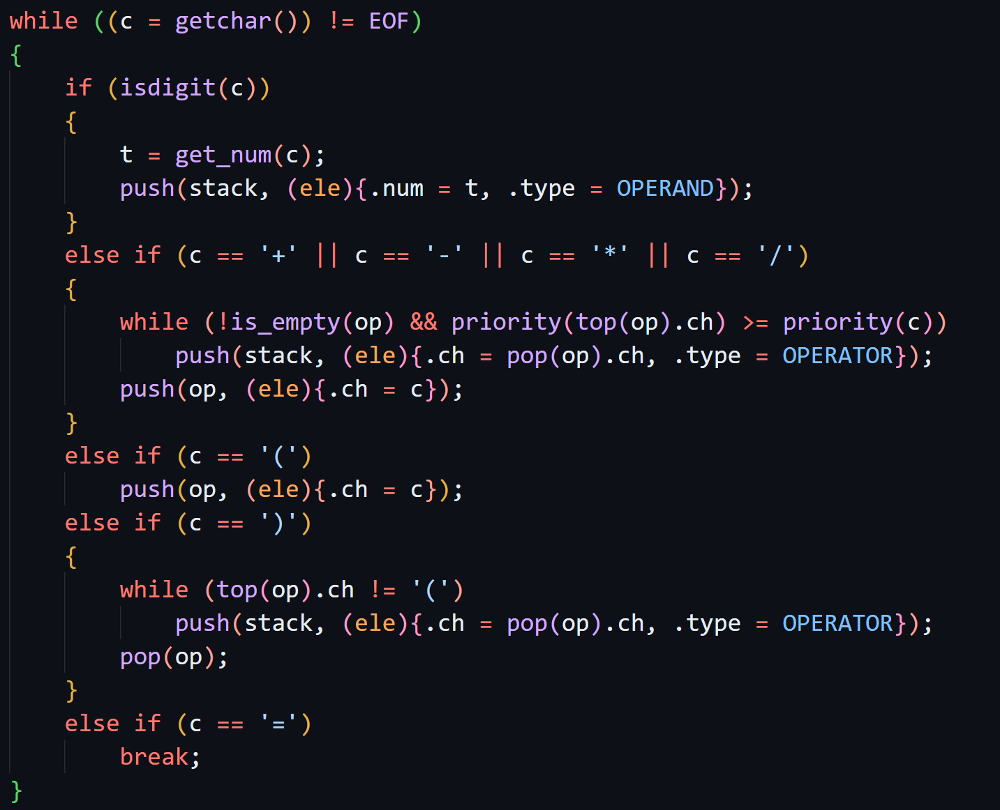

# 22级DS第四次作业

$Author : \mathcal{Red}$

有任何问题请与 ProjektRed@buaa.edu.cn 联系

## 选择

1. 分清顺序/链式存储与线性/非线性结构：

   - 存储：顺序存储为顺序表（数组），链式存储为链表；
   - 线性结构：元素有序（有前后关系）即为线性结构，否则为非线性。

2. 从递归调用思考，使用的参数为调用该函数时传入的，也就是最新传入的，而在使用后参数也将从结构中删除；返回地址也是类似，但返回的实际原理大家可能并不了解，可以不考虑这方面，在学 CO 课程时会有更深刻的理解。所以考虑实现上述需求需要什么数据结构。

3. 队列先入先出，对顺序没用影响，统计任意时刻栈内元素个数最大值即可。

4. 可以实际模拟一下试试能不能实现。

   > 一些速通技巧：在单个栈的出栈队列中，假设入栈队列为 $1,2,3,\dots,n$，那么在某个数出现后，找到其后所有比它小的数，得到的序列一定是单减的，否则不合法。
   >
   > 如 $4\ 3\ 1\ 2\ 5$ 中，$4$ 后面所有比它小的数的序列为 $3\ 1\ 2$，不为单调减，不合法
   >
   > $1\ 4\ 3\ 5\ 7\ 6\ 2$ 中，$1$ 后无，$2$ 后无，$3$ 后为 $2$，$4$ 后为 $3\ 2$，$5$ 后为 $2$，$6$ 后为 $2$，$7$ 后为 $6\ 2$，均为单减，故合法（操作串为 SXSSSXXSXSSXXX）

5. 类似上题。

6. 根据规则转换~不多说了。

7. 修改 p 的两个指针与插入左右节点需要改动的一侧的指针。

8. 顺序存储结构可能会满。

9. 先进先出。

10. 第一个元素进入队列后，`front` 为队头元素 $0$，`rear` 为队尾元素也为 $0$，则倒推一下，即可得到初始状态的 `front` 与 `rear`。

11. 喵~

12. T3 弱化版。

13. 队列为在队尾添加元素，在队头删除元素。

    - 出队（删除元素）：`front` 后移；
    - 入队（增加元素）：`rear` 后移。

## 填空

5. 本题的后缀表达式各元素中间不需要空格（黏在一起也没事，很神奇吧）。


7. 填 $M$ 与 $M-1$ 均正确。
   - $M-1$：不维护额外信息的循环队列只能容纳 $M-1$ 个元素，否则有 $M$ 个元素时，$front = rear$，无法区分空与满；
   - $M$：仅需维护是否为空即可。

## 编程 Hint

### BRACKET

可以把自己的代码作为一个样例，以下为另一些易错的样例。

#### TESTCASE #1

```
/***/()*/
```

### CALCULATER

按照规则转后缀表达式，然后计算。

转换方式可参考：



### 臭名昭著的BANK

感谢的总结

一周期内进行的操作

1. 加入本周期内所有新的顾客到队列

2. <font color=DD0000>**当且仅当**</font>有新的顾客到队列（第一步执行），检查是否需要增加窗口

3. 空闲且激活的窗口和窗口的顾客已经服务完成的，从队列弹出顾客进入窗口服务

4. 窗口服务顾客（窗口服务顾客指的是<font color=DD0000>**所有有顾客的窗口**</font>，包括不被激活但是有顾客的窗口）

   > $\color{red}{\text{Red}}$ 注：如果有人进服务了，就会一直处于服务中状态，也即是现在当前窗口数不影响当前服务中的人，而当且仅当当前服务人数少于当前窗口数时有窗口可以服务新人

5. 队列中的顾客等待

6. 检查是否需要减少窗口（只需要看减少前的平均等待人数是否小于7，不需要考虑减少后平均等待人数是否小于7，也就是说不管怎么样<font color=DD0000>**只要平均人数少于7就减少窗口**</font>）

7. 周期结束

#### 伪代码

```c
while (round <= n || !queue_empty()) {
    if (round <= n) {
        add_customer();
        increase_window();
    }
    serve();  // 服务所有处在服务中状态的顾客
    decrease_window(); // 只要当前平均人数小于7就减少窗口
    round++;
}
```

